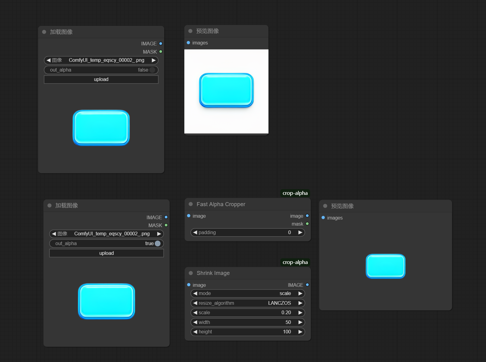

# ComfyUI-crop-alpha

## 语言切换
要切换到英文版本，请点击[这里](README.md).

## 介绍
透明区域自动裁切，防止图片太大， 同时也支持缩小功能， 防止图片尺寸太大

## 功能
- 透明区域裁剪
- 图像缩小

## 效果图

## 使用方法
1. 下载项目代码。
2. 将代码放入ComfyUI的自定义节点目录。
3. 在ComfyUI中使用该节点进行图像裁剪。

## 贡献
欢迎任何形式的贡献，包括但不限于代码优化、功能扩展、文档改进等。

## 许可证
本项目采用MIT许可证。